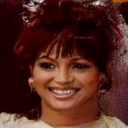

# 🧠 Diffusion Models (DDPM) Implementation on CelebA

[](https://pytorch.org/) [](https://www.python.org/)

This project show the implementation of Denoising Diffusion Probabilistic Models (DDPM) for high-quality image synthesis. The model is trained on the CelebA face dataset using a custom **U-Net** architecture as the noise prediction network.




## Objectives

The core technical challenge involves designing and integrating the U-Net architecture to master the iterative denoising process.

### 1. Theoretical Foundation
- **Forward Process :** Implementation of the noise schedule ($\beta_t$,$\alpha_t$) to progressively add Gaussian noise to images.
- **Reverse Process :** Learning to reverse the diffusion process to recover $x_0$ from pure noise $x_T$.

### 2. U-Net Architecture
- Adaptation of the classic U-Net (segmentation) for **$\epsilon$-prediction**.
- Implementation of Sinusoidal Time Embeddings to inform the network of the current noise level.
- Use of **Skip Connections** to preserve fine spatial details.

### 3. Data Pipeline
- Robust handling of the **CelebA dataset**.
- Preprocessing: Resizing (64x64 or 128x128) and Normalization to the range $[-1, 1]$.

---

##  Installation

To run this project you need to create a conda environnement.


1. **Clone the repository:**
   ```bash
   git clone [https://github.com/Simon773/diffusion_model.git](https://github.com/Simon773/diffusion_model.git)
   cd diffusion_model
   ```
Then for create the conda environnement and download required packages, you can use this command :
   ```bash
    conda create --name diffusion_env python=3.12 -y
    conda activate diffusion_env

    pip install -r requirements.txt
   ```

## Project Structure : 

- **config.yaml** : A file defining hyperparameters for the training and the generation of images. You can adjust the size of images, batch, epochs...

- **data** : This folder is not provided in this repo but it contains all the data necessary for the training. You can find data here : [CelebA Dataset](https://www.kaggle.com/datasets/jessicali9530/celeba-dataset)

- **dataset** : This file allow to transform images for training (resizing,normalizing,transformation to a tensor...)

- **diffusion** : This folder contain only one file : noise_schedule.py. There are functions for add noise to an image, reverse the noise.

- **generated_images** : This folder contains some generated images. 

- **models**: A folder for model that we can use. Here there is only the Unet model in pytorch format with the forward process

- **models_save** : Not included. A folder where you can add your model in .pt format. Model use in this project is available in [Huggin Face](https://www.kaggle.com/datasets/jessicali9530/celeba-dataset).

-**modules**. Contrains file useful for the implementation of U-Net architecture (double convolutiion block, sinusidal positional embeddings...)

-**test**: Sandbox for tests such that,see generated images...

-**training**: Folder useful to train U-Net and generate image


## Training : 
In order to train the model, you can use your own computer and run this file:
Note : for training, you can modify config.yaml 
```bash
python -m training.training_unet
```
or train the model in Google Colab or Kaggle Notebook with a notebook : 
```bash
training_kaggle.ipynb
```

## Generation:
Same as before you can generate in your own computer or in Google Colab or Kaggle Notebook : 
```bash
python -m tests.test_generated_image.py
```
with Googe Colab :
```bash
generate_images_colab.ipynb
```